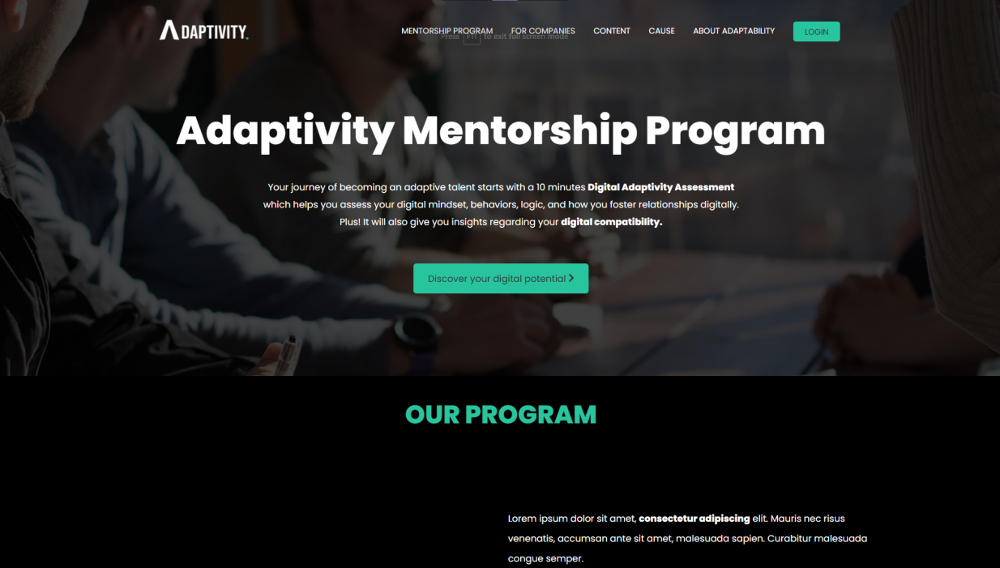
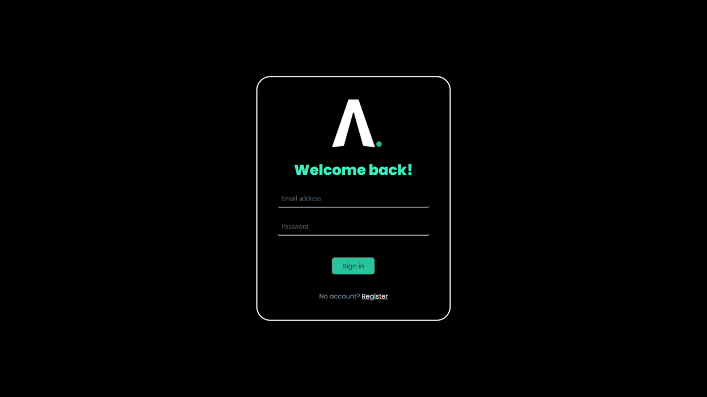

## Table of Contents

- [Table of Contents](#table-of-contents)
- [About The Project](#about-the-project)
- [Live Site](#live-site)
- [Webpage](#webpage)
  - [Landing Page](#landing-page)
  - [Login Page](#login-page)
  - [AI Recommends Page](#ai-recommends-page)
- [Built With](#built-with)

## About The Project

As part of our Industrial Project, our group of 4 was teamed with [Adaptivity](https://adaptivity.us/aboutus/). Tasked in recreating the work flow from the Digital Assessment to a force graph based on their results from the assessment.

Using [Typeform ](https://www.typeform.com/product/), a code-free web based platform to create surveys, makes arranging logics of surveys and collecting results with ease. 

With storing the assessment results in MongoDB in mind, we decided on [Integromat](https://www.integromat.com/en/integrations/mongodb/typeform) for the integration from Typeform to MongoDB.

<!-- About Adaptivity team, us and the tech stacks used -->
<!-- Typeform used for the assessment, Integromate used for the connection to mongodb -->

## Live Site

Click [here](https://adaptivity.herokuapp.com/) for a live demo of the site hosted on Heroku.

## Webpage

### Landing Page

### Login Page

### AI Recommends Page

## Built With

1. NodeJS
2. Express
3. MongoDB
4. CSS
5. JavaScript
   

